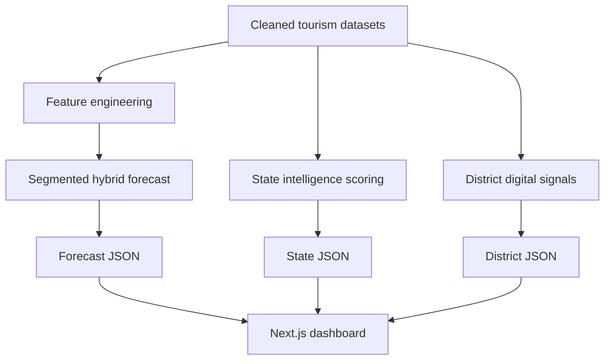

# Tourism Intelligence Dashboard — Developer Handoff Guide

## 1. Purpose

This document explains how to integrate the completed tourism machine-learning outputs into the existing Sustainable Tourism Intelligence datathon dashboard in this repository.

The machine-learning pipeline is complete and merged into `main`. The full-stack developer is responsible for presenting the exported outputs accurately through the existing Next.js interface.

The dashboard must:

- Preserve and extend the datathon dashboard already created by the full-stack developer. Do not replace, reset, or migrate the existing interface. Integrate the ML outputs into its current layout, components, navigation, and design language.
- Use only the supplied data and ML outputs.
- Avoid fabricated attractions, users, reviews or interactions.
- Work through a publicly accessible URL.
- Require no local installation for judges.
- Clearly communicate that Google Trends is a digital-interest proxy.
- The dashboard implementation created by the full-stack developer is the official datathon interface. The ML outputs are data sources for that dashboard; they are not instructions to rebuild the website around JomExplore.

This is a datathon implementation. It is not an MVP or commercial product.

---

## 2. Current Project Status

Completed ML work includes:

- Data auditing and cleaning
- Duplicate-series handling
- Geographic series registry
- Feature engineering
- Baseline forecasting
- Direct CatBoost experiments
- Tourism-context experiments
- Residual CatBoost experiments
- Rolling-origin validation
- Final untouched 2025 testing
- Segmented hybrid model selection
- State tourism-intelligence scoring
- District digital-signal scoring
- District development-context scoring
- Data-confidence classification
- Metadata and checksum generation

Current output coverage:

| Output | Count |
|---|---:|
| State series | 16 |
| District/area series | 151 |
| Total forecast series | 167 |
| Districts with digital scores | 116 |
| Constant/unscored districts | 35 |
| Districts with usable development context | 148 |
| Districts without sufficient development context | 3 |

---

## 3. Ownership and Responsibilities

### ML engineer

The ML engineer owns:

- Model methodology
- Feature-engineering decisions
- Validation design
- Final evaluation
- Output definitions
- Score interpretation
- Technical limitations
- Data-contract verification
- Final integration accuracy review

### Full-stack and dashboard developer

The full-stack developer owns:

- Next.js frontend implementation
- Dashboard routing
- Components and responsive layout
- Charts and tables
- Search and filtering
- Empty and error states
- Static-data integration
- Deployment
- Public live URL
- Application README
- Demo screen recording
- Dashboard sections of the report

---

## 4. Source-of-Truth Files

### Primary frontend files

The dashboard should primarily consume these JSON files:

```text
ml/outputs/demand_forecast_latest.json
ml/outputs/state_tourism_intelligence_latest.json
ml/outputs/district_emerging_signals_latest.json
```

### Supporting files

```text
ml/outputs/series_registry.csv
ml/outputs/district_series_crosswalk.csv

ml/artifacts/model_metadata.json
ml/artifacts/scoring_metadata.json
ml/artifacts/district_signal_metadata.json
ml/artifacts/export_manifest.json
```

### Model artifact

```text
ml/artifacts/tourism_demand_residual_model.cbm
```

The `.cbm` file is retained for reproducibility. It must not be downloaded or executed by the browser.

The current website only needs the precomputed JSON outputs. Live CatBoost inference is not required.

---

## 5. Data Flow



The frontend must not recreate, alter or recalculate the ML scores.

---

## 6. Recommended Integration Architecture

For the datathon, use precomputed static JSON.

Recommended flow:

```text
ml/outputs/*.json
        ↓
build-time copy
        ↓
public/data/*.json
        ↓
Next.js fetch()
        ↓
dashboard components
```

Recommended public files:

```text
public/data/demand_forecast_latest.json
public/data/state_tourism_intelligence_latest.json
public/data/district_emerging_signals_latest.json
```

Advantages:

- No separate Python server
- No CatBoost installation during deployment
- No runtime model failure
- No API credentials
- Fast loading
- Works on a static/public deployment
- Easy for judges to access

The files in `public/data` should be copied from `ml/outputs`. They should not be edited manually.

---

## 7. Optional Build-Time Synchronisation

The developer may create:

```text
scripts/sync-ml-data.mjs
```

Example implementation:

```javascript
import { copyFile, mkdir } from "node:fs/promises";
import path from "node:path";

const root = process.cwd();
const source = path.join(root, "ml", "outputs");
const destination = path.join(root, "public", "data");

await mkdir(destination, { recursive: true });

const files = [
  "demand_forecast_latest.json",
  "state_tourism_intelligence_latest.json",
  "district_emerging_signals_latest.json",
];

for (const filename of files) {
  await copyFile(
    path.join(source, filename),
    path.join(destination, filename),
  );

  console.log(`Copied ${filename}`);
}
```

Possible `package.json` scripts:

```json
{
  "scripts": {
    "sync:ml-data": "node scripts/sync-ml-data.mjs",
    "dev": "npm run sync:ml-data && next dev",
    "build": "npm run sync:ml-data && next build"
  }
}
```

The developer should adapt this to the current `package.json` without removing existing scripts.

---

## 8. Forecast Output Contract

Primary file:

```text
ml/outputs/demand_forecast_latest.json
```

Expected records:

```text
167
```

Geographic coverage:

```text
16 state records
151 district_or_area records
```

Core fields that the frontend may rely on include:

| Field | Meaning |
|---|---|
| `series_id` | Unique identifier for the geographic series |
| `state` | Malaysian state |
| `area` | District/area name or state-level label |
| `geo_level` | `state` or `district_or_area` |
| `forecast_month` | Month being predicted |
| `forecast_trend_index` | Predicted Google Trends index |
| `forecast_method` | Method used for the series |

Additional fields may be present. The frontend should inspect the actual JSON instead of assuming undocumented names.

### Geographic identifier

Use:

```text
series_id
```

as the main identifier.

Example:

```text
Sarawak | district_or_area | Kuching
```

Do not join datasets using only `area`. The same area name may exist in different states or may use alternate spellings.

### Forecast meaning

`forecast_trend_index` is a forecast of the next-month Google Trends index.

It is not:

- Forecast tourist arrivals
- Forecast visitor population
- Hotel occupancy
- Tourism revenue
- Probability of tourism growth

Approved label:

```text
Forecast Search Interest Index
```

Also acceptable:

```text
Next-Month Digital Interest Forecast
```

Do not label it:

```text
Predicted Tourists
```

---

## 9. Forecasting Method

The selected model is a segmented hybrid.

### State series

State forecasts use:

```text
Three-month mean + CatBoost residual correction
```

### District/area series

District forecasts use:

```text
Three-month mean
```

### Constant or insufficient series

These use:

```text
Three-month mean
```

The segmentation was selected through rolling-origin validation, not after viewing the final test result.

---

## 10. Forecast Validation Results

Rolling-origin validation years:

```text
2022
2023
2024
```

Final untouched test year:

```text
2025
```

Key results:

| Result | Value |
|---|---:|
| Validation folds won by hybrid | 2 of 3 |
| Mean validation MAE improvement | 1.98% |
| Final 2025 test improvement | 1.82% |
| Hybrid test MAE | 1.821 |
| Three-month baseline test MAE | 1.854 |
| Hybrid test RMSE | 4.129 |
| State hybrid MAE | 7.227 |
| State baseline MAE | 7.505 |
| District hybrid MAE | 1.075 |
| District baseline MAE | 1.075 |

The dashboard does not need to show every metric on the main screen. These results belong in the methodology section or an information modal.

---

## 11. State Intelligence Output

Primary file:

```text
ml/outputs/state_tourism_intelligence_latest.json
```

Expected records:

```text
16
```

The state output contains relative indicators intended to support state-level comparison.

It includes:

- Latest tourism context
- Forecast momentum
- Opportunity score
- Tourism-pressure score
- Component values
- Classification
- Leading drivers
- Source years and limitations

The exact field names must be read from the JSON and:

```text
ml/artifacts/scoring_metadata.json
```

Do not rename a field without preserving its meaning.

### State opportunity score

The state opportunity score combines relative indicators such as:

- Visitor growth
- Tourism spending value
- Forecast momentum
- Search growth
- Tourism headroom
- Development context

It is a relative composite score across 16 states.

It is not:

- Investment return
- Probability of success
- Predicted tourism revenue
- Destination quality
- Government funding priority

### Tourism-pressure score

The tourism-pressure score represents relative monitoring pressure based on:

- Tourism intensity
- Visitor growth
- Forecast momentum
- Search growth

It does not directly measure:

- Environmental damage
- Carbon emissions
- Waste production
- Tourist dissatisfaction

Those outcomes were not directly available in the supplied data.

### State confidence

The state output does not use the district `data_confidence` system.

Do not invent high, medium or low confidence labels for state records unless a future ML output explicitly provides them.

---

## 12. District Intelligence Output

Primary file:

```text
ml/outputs/district_emerging_signals_latest.json
```

Expected records:

```text
151
```

Important fields include:

| Field | Meaning |
|---|---|
| `series_id` | Unique series identifier |
| `state` | State |
| `area` | Original search-area label |
| `canonical_district` | Validated DOSM district name |
| `mapping_confidence` | Confidence in the geographic mapping |
| `forecast_month` | Predicted month |
| `forecast_trend_index` | Forecast search-interest index |
| `digital_emerging_signal_score` | Relative digital-interest momentum score |
| `development_support_context_score` | Relative socioeconomic support context |
| `signal_quality` | Quality of the Trends series |
| `signal_category` | Dashboard classification |
| `leading_signal_components` | Strongest digital-signal components |
| `data_confidence` | Overall district signal confidence |

---

## 13. District Digital Emerging-Signal Score

The digital emerging-signal score uses within-series changes.

Components:

| Component | Weight |
|---|---:|
| Recent three-month change | 35% |
| Twelve-month change | 30% |
| Recent trend slope | 20% |
| Next-month projected change | 15% |

The score ranges from 0 to 100 for eligible districts.

It is percentile-based and relative to other eligible districts.

A score of `80` does not mean:

```text
80% probability of tourism growth
```

It means the district’s recent digital-interest pattern ranks relatively highly among the eligible district series.

### Critical Google Trends limitation

Google Trends indices are normalized separately for each series.

Therefore:

```text
District A: index 80
District B: index 60
```

does not prove that District A has more total searches than District B.

The dashboard may compare:

- Direction
- Momentum
- Score
- Category
- Confidence

The dashboard must not claim absolute search-market size.

---

## 14. Development-Support Context Score

The development-support context score is separate from the digital score.

Components:

| Component | Weight |
|---|---:|
| Poverty context | 40% |
| Lower median-income context | 35% |
| Unemployment context | 25% |

A higher score indicates relatively higher development-support needs.

It does not mean:

- Better tourism potential
- Greater popularity
- Higher tourism demand
- Higher investment return
- Poor destination quality

Approved label:

```text
Development Support Context
```

Avoid:

```text
Tourism Opportunity Score
```

for district-level output.

---

## 15. District Categories

Possible `signal_category` values:

### `emerging_signal_support_priority`

Meaning:

- High digital emerging signal
- Higher development-support context

Recommended display:

```text
Emerging Signal + Support Priority
```

### `rising_digital_interest`

Meaning:

- High digital signal
- Lower development-support context

Recommended display:

```text
Rising Digital Interest
```

### `development_context_monitoring`

Meaning:

- Lower digital signal
- Higher development-support context

Recommended display:

```text
Development Context Monitoring
```

### `stable_or_lower_digital_signal`

Meaning:

- Digital signal is below the high-signal threshold
- Development context is below the high-support threshold

Recommended display:

```text
Stable or Lower Digital Signal
```

### `insufficient_digital_variation`

Meaning:

- Trends values are constant or insufficiently variable
- No reliable district digital score is produced

Recommended display:

```text
Insufficient Digital Variation
```

Do not display these records as having a score of zero.

### `digital_signal_only_context_incomplete`

Meaning:

- A digital signal exists
- Socioeconomic context is insufficient

Recommended display:

```text
Digital Signal Available — Context Incomplete
```

---

## 16. Current District Category Counts

Current distribution:

| Category | Districts |
|---|---:|
| Stable or lower digital signal | 62 |
| Development-context monitoring | 38 |
| Insufficient digital variation | 35 |
| Rising digital interest | 11 |
| Emerging signal support priority | 5 |

These counts can be used for integration testing.

They should not be hard-coded as permanent UI values. Future data refreshes may change them.

---

## 17. Confidence Fields

### `data_confidence`

This is the main confidence field for the district dashboard.

Current values:

| Confidence | Districts |
|---|---:|
| `high` | 83 |
| `medium` | 33 |
| `low` | 35 |

Interpretation:

#### High

- Informative Trends series
- Complete development context
- No medium-confidence mapping issue

#### Medium

One or more of the following:

- Limited Trends variation
- Medium-confidence geographic mapping
- Incomplete context components

#### Low

- Constant or insufficient digital variation
- No digital emerging-signal score

### `signal_quality`

Possible values:

```text
informative
limited_variation
insufficient_variation
```

Use this to explain why a confidence label was assigned.

### `mapping_confidence`

This refers only to name matching between the Google Trends area and DOSM district.

It is not model confidence.

### Recommended UI

Example:

```text
Digital signal: 89.85
Confidence: Medium
Reason: Limited search-index variation
```

Confidence must be presented using text or an icon plus text. Do not rely only on colour.

---

## 18. Missing-Value Rules

### Missing digital score

Thirty-five districts have:

```text
digital_emerging_signal_score = null
```

Display:

```text
Insufficient digital variation
```

Do not convert `null` to:

```text
0
```

Zero would incorrectly imply that a valid score was calculated.

### Missing development context

Three districts do not have enough socioeconomic components.

Display:

```text
Development context unavailable
```

Do not:

- Replace with zero
- Replace with the national average
- Hide the record
- Invent a score

### Sorting

When sorting by score:

1. Sort valid numbers normally.
2. Place `null` values last.
3. Keep unscored records accessible through filters.

---

## 19. Geographic Mapping Rules

The crosswalk file is:

```text
ml/outputs/district_series_crosswalk.csv
```

It contains 151 validated mappings.

Three explicit overrides were required:

| State | Search-area name | DOSM district | Confidence |
|---|---|---|---|
| Sarawak | Tanjung | Tanjung Manis | Medium |
| Selangor | Hulu Langat | Ulu Langat | High |
| Selangor | Hulu Selangor | Ulu Selangor | High |

For display:

- `area` may be used as the user-facing search label.
- `canonical_district` should be used when referring to DOSM context.
- `series_id` must remain the technical unique identifier.

Do not rebuild these mappings in frontend code.

---

## 20. Recommended Routes

Suggested routes:

```text
/
```

Existing Sustainable Tourism Intelligence dashboard overview.

```text
/intelligence
```

National tourism-intelligence overview.

```text
/intelligence/states
```

State comparison and state-level indicators.

```text
/intelligence/states/[state]
```

Selected state details.

```text
/intelligence/districts
```

District digital-signal explorer.

```text
/intelligence/methodology
```

Methodology, validation and limitations.

The developer may adapt these routes to the existing information architecture, but state and district concepts must remain separate.

---

## 21. Recommended Dashboard Components

Suggested component structure:

```text
components/
├── intelligence/
│   ├── IntelligenceHeader.tsx
│   ├── CoverageSummary.tsx
│   ├── StateSelector.tsx
│   ├── StateScoreCard.tsx
│   ├── StateComparisonChart.tsx
│   ├── ForecastCard.tsx
│   ├── DistrictFilter.tsx
│   ├── DistrictSignalTable.tsx
│   ├── DistrictSignalCard.tsx
│   ├── ConfidenceBadge.tsx
│   ├── CategoryBadge.tsx
│   ├── MethodologyPanel.tsx
│   └── DataLimitationNotice.tsx
```

This is a recommendation, not a required folder structure.

---

## 22. Recommended Visualisations

### National overview

Show:

- 16 state series
- 151 district/area series
- 167 total forecasts
- Latest forecast month
- Model version
- Data-generation date

### State view

Suitable visualisations:

- State opportunity versus pressure scatter plot
- State ranking table
- Forecast direction card
- Score-component bar chart
- Leading-driver summary

### District view

Suitable visualisations:

- Filterable district table
- Digital signal ranking
- Development-context comparison
- Category distribution chart
- Confidence distribution
- District detail panel

### Avoid misleading charts

Do not create:

- A chart labelled predicted tourists
- A raw cross-district Google Trends index ranking
- A probability gauge for percentile scores
- A map implying missing districts have zero demand
- Environmental-impact claims without environmental data

---

## 23. Filters and Interactions

Recommended controls:

- State filter
- District search
- Signal-category filter
- Confidence filter
- Signal-quality filter
- Sort by digital score
- Sort by development context
- Show/hide unscored districts

Default behaviour:

- Show all districts.
- Place null scores last.
- Clearly mark insufficient data.
- Preserve filters while opening a district detail panel.

No real user account or user-interaction dataset exists. Do not implement fake personalised recommendations, fake reviews or fake user histories.

---

## 24. Loading and Error States

Every data-driven page should handle:

### Loading

```text
Loading tourism intelligence…
```

### Missing file

```text
Tourism intelligence data is currently unavailable.
```

### Empty filtered result

```text
No locations match the selected filters.
```

### Missing district score

```text
Insufficient digital variation for a reliable score.
```

### Missing context score

```text
Development context is unavailable for this district.
```

Do not let the interface crash when a value is `null`.

---

## 25. Date Handling

Forecast dates may be stored as:

```text
YYYY-MM-DD
```

Avoid local timezone shifting.

Do not assume that:

```javascript
new Date("2026-01-01")
```

will always render identically in every timezone.

Safer approaches include:

- Displaying the year-month directly from the string
- Parsing as UTC
- Appending `T00:00:00Z` when appropriate

For monthly values, an output such as:

```text
January 2026
```

is preferable to a full timestamp.

---

## 26. Number Formatting

Recommended formatting:

| Value | Display |
|---|---|
| Signal score | One decimal place |
| Context score | One decimal place |
| Forecast index | One or two decimal places |
| Percent change | One decimal place with sign |
| Missing value | `Unavailable` |
| Confidence | Capitalised label |

Examples:

```text
89.8
+12.4%
Medium confidence
Unavailable
```

Do not add a percentage symbol to percentile scores unless the UI explicitly says “percentile.”

A score of `89.8` is not automatically `89.8%`.

---

## 27. Colour and Accessibility

Recommended semantic treatment:

- High confidence: green or teal
- Medium confidence: amber
- Low confidence: grey or muted red
- Emerging support priority: purple or amber
- Rising interest: blue or green
- Monitoring: orange
- Stable/lower signal: grey
- Insufficient variation: neutral grey

Requirements:

- Never communicate meaning through colour alone.
- Include visible text.
- Maintain sufficient colour contrast.
- Support keyboard navigation.
- Add accessible chart labels.
- Use descriptive button text.
- Do not place essential definitions only in hover tooltips.

---

## 28. TypeScript Types

The developer should create types based on the actual JSON.

Minimum forecast interface:

```typescript
export interface DemandForecastRecord {
  series_id: string;
  state: string;
  area: string | null;
  geo_level: "state" | "district_or_area";
  forecast_month: string;
  forecast_trend_index: number;
  forecast_method: string;
  [key: string]: unknown;
}
```

District interface:

```typescript
export type DataConfidence = "high" | "medium" | "low";

export type SignalQuality =
  | "informative"
  | "limited_variation"
  | "insufficient_variation";

export type SignalCategory =
  | "emerging_signal_support_priority"
  | "rising_digital_interest"
  | "development_context_monitoring"
  | "stable_or_lower_digital_signal"
  | "insufficient_digital_variation"
  | "digital_signal_only_context_incomplete";

export interface DistrictSignalRecord {
  series_id: string;
  state: string;
  area: string;
  canonical_district: string;
  mapping_confidence: "high" | "medium";
  forecast_month: string;
  forecast_trend_index: number;
  digital_emerging_signal_score: number | null;
  development_support_context_score: number | null;
  signal_quality: SignalQuality;
  signal_category: SignalCategory;
  leading_signal_components: string;
  data_confidence: DataConfidence;
  context_component_count: number;
  [key: string]: unknown;
}
```

The state interface must be defined after inspecting:

```text
state_tourism_intelligence_latest.json
```

Do not guess state field names.

---

## 29. Runtime Validation

After loading the JSON, validate at least:

```typescript
if (forecasts.length !== 167) {
  console.warn("Unexpected forecast record count");
}

if (stateRecords.length !== 16) {
  console.warn("Unexpected state record count");
}

if (districtRecords.length !== 151) {
  console.warn("Unexpected district record count");
}
```

Also check:

- `series_id` values are unique.
- Every district has a state.
- Every district has a category.
- Every district has a confidence value.
- Scores are between 0 and 100 when present.
- Null scores remain null.
- Dates are valid strings.

These checks should not expose stack traces to judges.

---

## 30. Frontend Data Utility Recommendation

Suggested utility location:

```text
lib/tourism-data.ts
```

Possible responsibilities:

- Fetch the JSON files
- Validate arrays
- Format categories
- Format confidence labels
- Filter state and district records
- Sort null values last
- Produce summary counts

Example:

```typescript
export function sortNullableScore(
  a: number | null,
  b: number | null,
): number {
  if (a === null && b === null) return 0;
  if (a === null) return 1;
  if (b === null) return -1;

  return b - a;
}
```

Avoid duplicating category labels and interpretation rules across multiple components.

---

## 31. Performance Guidance

The files are small enough for a datathon dashboard.

Recommended:

- Fetch each JSON file once.
- Cache or memoise transformed arrays.
- Avoid repeating filters in every child component.
- Use server components where convenient.
- Use client components only where interaction is needed.
- Avoid sending the CatBoost model to the client.
- Avoid loading raw cleaned CSV datasets into the browser.

Virtualisation is not required for only 151 district rows unless the table becomes significantly more complex.

---

## 32. Security and Privacy

The current outputs contain aggregate geographic information.

They do not contain:

- User accounts
- Personal travel histories
- Names
- Email addresses
- Individual location traces
- Personal recommendations

Requirements:

- Do not add fabricated user data.
- Do not expose environment secrets.
- Do not include local file paths in deployed code.
- Do not expose the `.cbm` model through public assets.
- Do not require judges to provide personal information.
- Do not require authentication unless explicitly required later.

---

## 33. Public Deployment Requirements

Judges must be able to open the application instantly.

The deployed application must:

- Have a public HTTPS URL.
- Open in a standard browser.
- Require no Next.js installation.
- Require no Flutter or Dart installation.
- Require no Python environment.
- Require no Colab session.
- Require no local database.
- Require no login.
- Include the required JSON data.
- Work in an incognito browser.
- Work on desktop and mobile.
- Load without access to a team member’s computer.

Before submission, test the live URL:

1. On a different device
2. In an incognito window
3. On mobile data
4. With browser cache disabled
5. After the developer’s local machine is shut down

If it stops working when the developer’s laptop is off, it is not properly deployed.

---

## 34. Deployment Failure Prevention

Before deployment, confirm:

- `npm install` completes.
- `npm run build` succeeds.
- JSON files exist in the deployed bundle.
- File paths use `/data/...`, not `/content/...`.
- Paths do not reference Windows drive letters.
- Paths do not reference Colab.
- File names match case exactly.
- No required data is ignored by `.gitignore`.
- No environment variable is required for static data.
- Charts render with empty or null values.
- Directly opening nested routes does not produce a 404.
- Refreshing the page preserves routing.

---

## 35. Application README Requirements

The full-stack developer’s main application README should include:

- Project title
- Datathon purpose
- Live URL
- Main dashboard features
- Technology stack
- Local development commands
- Build command
- Data-source summary
- ML-output paths
- Folder structure
- Route summary
- Deployment instructions
- Known limitations
- Credits and team roles

The README must not require judges to run the project. Local instructions are for reviewers and reproducibility only.

---

## 36. Demo Recording Requirements

The full-stack developer owns the screen recording.

Recommended flow:

1. Open the live URL.
2. Introduce the national overview.
3. Select a state.
4. Explain state opportunity and pressure.
5. Open the district explorer.
6. Filter by category.
7. Show a high-confidence district.
8. Show a medium-confidence district.
9. Show an insufficient-variation district.
10. Open the methodology/limitations section.
11. End with the live URL visible.

The recording must use the deployed application, not localhost.

Avoid claiming:

- The model predicts tourist arrivals.
- The highest score is the best destination.
- Higher development need guarantees tourism potential.
- Search interest proves causation.
- The system uses real user behaviour.

---

## 37. Integration Acceptance Checklist

### Data

- [ ] Forecast JSON loads successfully
- [ ] State JSON loads successfully
- [ ] District JSON loads successfully
- [ ] Forecast count is 167
- [ ] State count is 16
- [ ] District count is 151
- [ ] `series_id` is used as the unique key
- [ ] Null scores remain null
- [ ] Scores remain within 0–100

### District interpretation

- [ ] `data_confidence` is visible
- [ ] `signal_quality` is explainable
- [ ] Medium-confidence districts are labelled
- [ ] Low-confidence districts are not assigned fake scores
- [ ] Development context is kept separate
- [ ] Geographic overrides are preserved

### State interpretation

- [ ] Opportunity score is not presented as investment return
- [ ] Pressure score is not presented as measured environmental damage
- [ ] State confidence is not invented
- [ ] Score components are available to the user

### Forecast interpretation

- [ ] Forecast is labelled as Google Trends/search interest
- [ ] Forecast is not labelled as tourist arrivals
- [ ] Forecast month is visible
- [ ] Forecast method is available
- [ ] Latest observed value is distinguished from forecast value

### User interface

- [ ] Responsive desktop layout
- [ ] Responsive mobile layout
- [ ] Keyboard-accessible controls
- [ ] Accessible colours
- [ ] Loading state
- [ ] Empty state
- [ ] Error state
- [ ] Null-data state
- [ ] Methodology and limitation notice

### Deployment

- [ ] `npm run build` succeeds
- [ ] Public URL works
- [ ] Incognito test passes
- [ ] Mobile test passes
- [ ] No login is required
- [ ] No local server is required
- [ ] No Colab runtime is required
- [ ] JSON is included in deployment
- [ ] Nested routes load directly
- [ ] Developer laptop can be turned off

---

## 38. ML Sign-Off Conditions

The ML engineer should approve the integration only when:

1. Forecasts are correctly described as search-interest forecasts.
2. State scores retain their original meanings.
3. District digital and development scores remain separate.
4. Confidence labels are visible.
5. Null values are handled accurately.
6. The dashboard does not fabricate tourism or user data.
7. Record counts pass validation.
8. The public URL displays the same outputs as the repository.
9. The methodology page includes the major limitations.
10. No frontend calculation changes the supplied scores.

Any change to weights, thresholds, categories or model outputs requires ML review.

---

## 39. Refreshing the Dashboard Data

When the ML outputs are updated:

1. Replace the JSON files in `ml/outputs`.
2. Run the data-sync script.
3. Confirm record counts.
4. Run the production build.
5. Review category and confidence counts.
6. Redeploy the application.
7. Verify the public URL.
8. Record the new generation date and model version.

Do not manually edit generated values in the public JSON.

---

## 40. Definition of Done

Dashboard integration is complete when:

- The public URL loads without installation.
- All three primary JSON outputs are connected.
- State and district views are clearly separated.
- District confidence is visible.
- Missing values are handled correctly.
- Forecasts are described accurately.
- The interface remains responsive.
- Methodology and limitations are accessible.
- Record-count checks pass.
- The live demo has been recorded.
- The ML engineer has completed the final accuracy review.

---

## 41. Questions for the ML Engineer

The developer should contact the ML engineer before:

- Renaming a score
- Combining district scores
- Changing score thresholds
- Recalculating categories
- Treating null as zero
- Adding confidence to state scores
- Describing the forecast as visitor arrivals
- Comparing raw Google Trends levels between districts
- Removing low-confidence records
- Adding new external tourism data
- Running the CatBoost model in production

For layout, styling, routing and chart-library decisions, the full-stack developer may proceed independently.